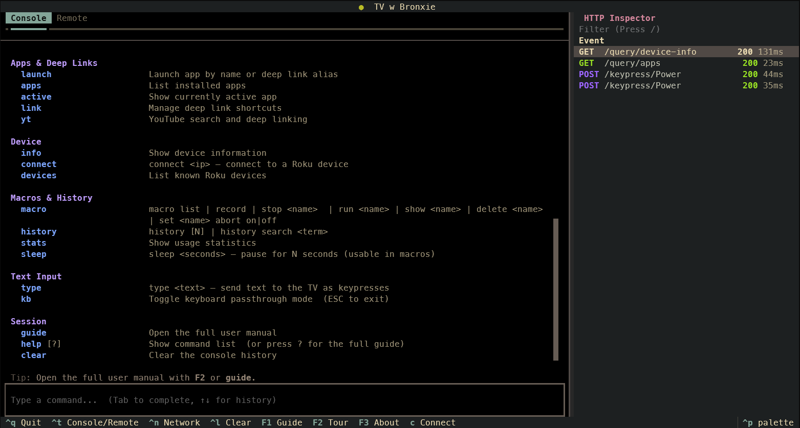
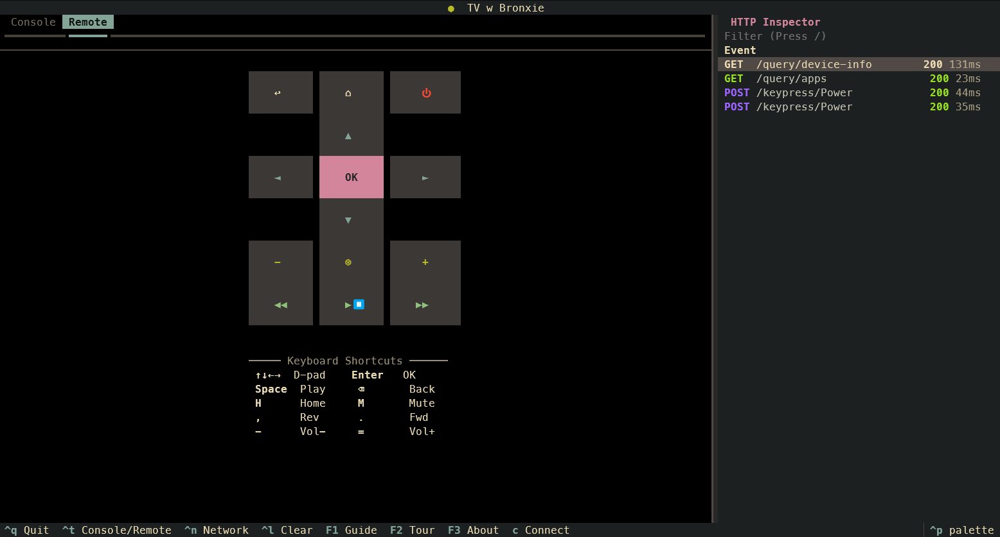
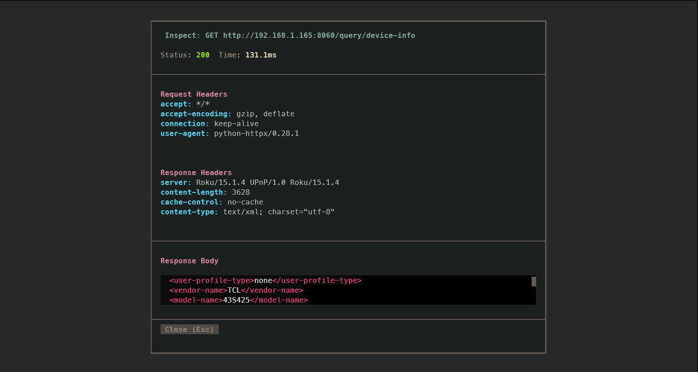

# roku-tui

[](https://www.python.org/downloads/)
[](https://textual.textualize.io/)
[](https://github.com/astral-sh/uv)

**Your Roku remote, inside your terminal. Type to control your TV — no phone, no plastic, no excuses.**

---

## The Problem With Every Roku Remote

You're at your computer. A show is playing on the TV. You need to pause it.

So you reach for your phone, unlock it, open the Roku app, wait for it to connect, and hit pause. Or you get up to find the physical remote. Or — be honest — you just let the show keep playing.

None of this makes sense. You have a keyboard right in front of you. **roku-tui** is a Roku remote that lives inside your terminal. You type what you want, and it happens. No unlocking, no waiting, no getting up.

---

## What It Looks Like


*The command console with real-time feedback and the network logger.*

<p align="center">
  
  
</p>
<p align="center">
  <i>The virtual remote (left) and detailed network inspector modal (right).</i>
  <br>
  <b>Note:</b> These screenshots were rendered using the <code>gruvbox</code> theme.
</p>

> 💡 **First time here?** Press **F2** inside the app (or type `tour`) to start the **Guided Tour**. It's the fastest way to learn how to control your TV from your terminal.

---

## Features for Power Users & Casuals

Whether you live in `tmux` or you're just looking for a beautiful way to control your TV, **roku-tui** is built for your workflow.

### ⚡ Velocity & Automation
- **Macros**: Record sequences and replay them with one command. Type `macro run morning` to go home and launch Netflix instantly.
- **Headless Mode**: Control your TV from your shell or cron jobs. `uv run roku-tui -c "home; launch YouTube"` turns on the TV and sets the scene.
- **Network Inspector**: A "God View" for your network. Watch every ECP HTTP request in real-time, with pretty-printed XML/JSON for every exchange.
- **Command Chaining**: Chain commands with semicolons. `u 5; s` navigates up five times and selects, faster than any physical remote.

### 🎨 Discovery & Aesthetics
- **Fuzzy Launch**: Don't scroll through 100 apps. Type `launch net` and the app finds Netflix for you.
- **YouTube Integration**: Search YouTube directly from the console (`yt search lo-fi beats`) and launch results by index (`yt launch 1`). No ads, no distractions.
- **Beautiful Themes**: Switch between `roku-night` (Tokyo Night), `catppuccin`, `nord`, and `gruvbox` to match your terminal setup.
- **Interactive Tour**: A step-by-step walkthrough built right into the UI. No manual required.

---

## Quick Start

### Option 1: Download a Binary
Grab the latest release for your platform from the [Releases page](https://github.com/hirekarl/roku_tui/releases). Download, run, and you're done.

### Option 2: Run from Source
Ensure you have [uv](https://github.com/astral-sh/uv) installed, then:

```bash
git clone https://github.com/hirekarl/roku_tui.git
cd roku_tui
uv sync

# Auto-discover Roku on your local network
uv run roku-tui

# No Roku? Use mock mode to explore the UI
uv run roku-tui --mock
```

> **Can't find your Roku?**
> On your Roku, go to **Settings → Network → About**. Note the IP address and run with: `uv run roku-tui --ip 192.168.1.42`.

---

## Headless Mode & Automation

Control your TV without opening the TUI by using the `-c` flag. This allows you to integrate **roku-tui** into your existing shell scripts or desktop automation.

```bash
# Example: Create a shell alias for your TV
alias tv-mute='uv run roku-tui --ip 192.168.1.50 -c "mute"'
```

For a complete guide on scheduling morning news, vacation mode simulation, and shell integration, see our **[Automation & Cron Guide](docs/automation.md)**.

---

## 📚 Deep Dives & Documentation

Explore these guides to get the most out of **roku-tui**:

- **[Automation & Cron Guide](docs/automation.md)**: Schedule routines and automate your TV.
- **[Macros: Automation & Sequences](docs/macros.md)**: Record and replay complex interactions.
- **[Troubleshooting & Connectivity](docs/troubleshooting.md)**: Fix discovery and connection issues.
- **[Customization & Themes](docs/themes.md)**: Personalize the UI with color palettes.
- **[Development & Architecture](docs/development.md)**: How the app is built and structured.
- **[Roku ECP Protocol](docs/ecp-protocol.md)**: Learn about the underlying network protocol.

---

## Design Philosophy: Our North Stars

**roku-tui** is designed to bridge the gap between high-velocity engineering tools and modern, aesthetic terminal applications. We build for two distinct "North Star" users:

### 🐧 Elias: The Power User
- **Profile**: A senior SRE who lives in `tmux` and Neovim. Efficiency is his only metric.
- **Usage**: Uses **Macros** to automate routines and relies on **Command Chaining** to navigate faster than humanly possible.
- **Influence**: Elias's needs drove the implementation of the **SQLite-backed macro engine** and the **headless automation** logic.

### 🎨 Michelle: The "TUI-Curious" Casual
- **Profile**: A designer who loves aesthetics. She’s intimidated by "black screens" but loves beautiful, functional tools.
- **Usage**: Discovered that typing `launch net` is easier than finding her remote. Uses `yt search` for work-day playlists.
- **Influence**: Michelle’s needs led to the **Interactive Guided Tour**, the **Tokyo Night/Nord themes**, and the **Integrated YouTube Search**.

---

## Commands

### Navigation
| Command | ECP key sent | Shorthand |
|---|---|---|
| `up` / `down` / `left` / `right` | D-pad | `u d l r` |
| `select` | Select | `s` |
| `back` | Back | `b` |
| `play` / `pause` | Play | `p` |
| `home` | Home | — |
| `mute` | VolumeMute | `m` |
| `volume <up\|down\|mute>` | Volume control | `vol` |
| `power` | Power | — |

*Tip: Add a count to repeat: `up 3`, `volume down 5`.*

### Apps & YouTube
| Command | Description | Aliases |
|---|---|---|
| `launch <name>` | Fuzzy-match launch an app or shortcut | — |
| `apps` | List installed channels | `channels` |
| `yt search <query>` | Search YouTube from the console | `youtube` |
| `yt launch <id>` | Launch a YouTube video by ID or index | — |
| `link save <alias> <app> <id>` | Save a deep link shortcut | `shortcut` |
| `kb` | Toggle live keyboard passthrough mode | `keyboard` |

<details>
<summary><b>Advanced: Device, Macros & History</b></summary>

#### Device & History
| Command | Description | Aliases |
|---|---|---|
| `info` | Device hardware and software info | `device` |
| `connect <ip>` | Connect to a different Roku | — |
| `history [N]` | Show last N commands | `hist` |
| `stats` | Usage statistics and top apps | — |

#### Macros
| Command | Description |
|---|---|
| `macro list` | All macros (builtin + yours) |
| `macro record` | Start recording commands |
| `macro stop <name>` | Stop and save recording |
| `macro run <name>` | Execute a saved macro |
| `macro show <name>` | Preview macro steps |
| `sleep <seconds>` | Pause execution (max 30s) |
</details>

---

## Keyboard Shortcuts

### Global
| Key | Action |
|---|---|
| `Tab` | Autocomplete command or app |
| `↑` / `↓` | Walk command history |
| `Ctrl+T` | Toggle Console/Remote tab |
| `Ctrl+N` | Toggle network inspector |
| `F1` | User Manual (Guide) |
| `F2` | Interactive Guided Tour |
| `F3` | About Screen |

### Remote Tab (Hotkeys)
| Key | Action |
|---|---|
| Arrow keys | D-pad |
| `Enter` | Select |
| `Space` | Play/Pause |
| `H` | Home |
| `M` | Mute |
| `-` / `=` | Volume down / up |

---

## Development

```bash
# Lint, Format & Type Check
uv run ruff check . --fix
uv run ruff format .
uv run mypy .

# Run Tests
uv run pytest
```

**Stack:** Python 3.12 · Textual · httpx · SQLAlchemy · SQLite · uv

---

## License & Credits

**roku-tui** is maintained by **[Karl Johnson](https://www.linkedin.com/in/hirekarl/)** and was built for the [Pursuit AI-Native program](https://www.pursuit.org/ai-native-program).

This project is licensed under the [MIT License](LICENSE).
